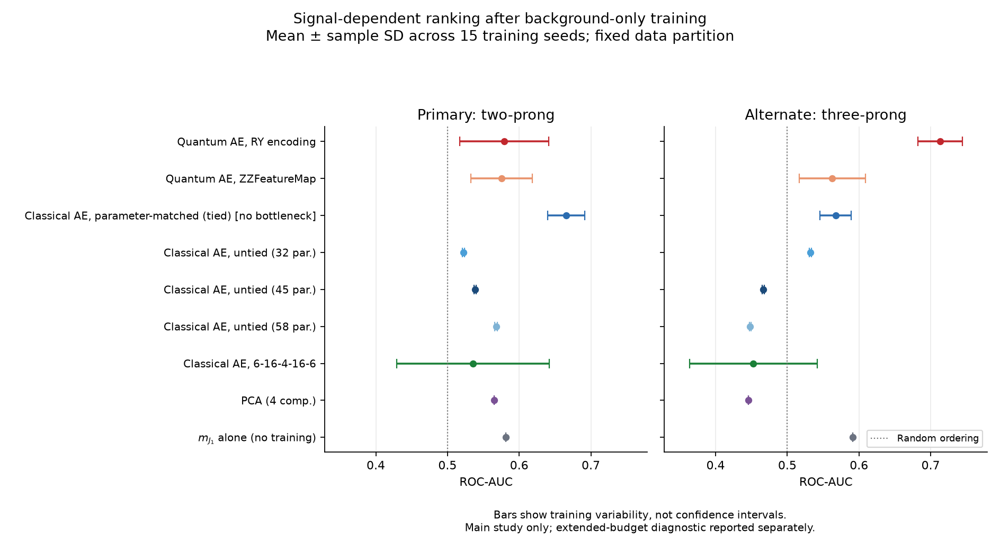

# Quantum autoencoder anomaly detection: a controlled LHCO benchmark

A six-qubit quantum autoencoder compared with classical autoencoders, PCA and
a jet-mass score on **simulated LHC Olympics 2020 events**. This is an
exploratory research benchmark, not a quantum-advantage demonstration or an
analysis of measured LHC collisions.

## Results first

The parameter-matched classical autoencoder has higher mean ROC-AUC and
background rejection on the primary two-prong signal. The RY quantum model
has higher mean ROC-AUC on the alternate three-prong signal. The ranking is
signal-dependent and survives the classical training-budget sensitivity check.

<!-- BEGIN RELEASE SUMMARY -->
| Model / epoch cap | Parameters | Primary AUC | Primary rejection at ε_S=0.3 | Three-prong AUC | Background ρ(score, m_JJ) | Median m_JJ shift, top 1% |
|---|---:|---:|---:|---:|---:|---:|
| RY quantum AE / 600 | 60 | 0.5790 ± 0.0618 | 4.98 ± 1.18 | 0.7130 ± 0.0310 | 0.024 ± 0.004 | (2.69 ± 1.13)% |
| ZZ quantum AE / 600 | 60 | 0.5756 ± 0.0431 | 4.57 ± 0.89 | 0.5627 ± 0.0460 | 0.008 ± 0.007 | (0.46 ± 0.17)% |
| Matched classical AE / 600 | 60 | 0.6658 ± 0.0258 | 9.03 ± 2.07 | 0.5673 ± 0.0219 | 0.041 ± 0.004 | (6.15 ± 1.69)% |
| Jet-mass control / no training | 0 | 0.5812 ± 0.0000 | 2.59 ± 0.00 | 0.5910 ± 0.0000 | 0.084 ± 0.000 | (16.10 ± 0.00)% |
| Matched classical AE / 3,000 (diagnostic) | 60 | 0.6554 ± 0.0167 | 8.54 ± 1.31 | 0.5618 ± 0.0175 | 0.041 ± 0.004 | (6.81 ± 1.41)% |
<!-- END RELEASE SUMMARY -->

These are means ± sample standard deviations across 15 initialisation/batch-order
seeds on **one fixed partition**, not confidence intervals over independent
datasets. The extended-budget classical result is a separate diagnostic, not
a replacement chosen for favourable test performance.

The last two columns are **background-only mass-sculpting diagnostics**. For
each seed, the median shift is `(selected median / inclusive median − 1) × 100`,
selecting the highest-scoring 1% of test background; the table then averages
those per-seed shifts. The classical AE's primary discrimination is better,
but these mass diagnostics are larger than the RY QAE's. This does not establish
that sculpting caused the AUC gain or quantify false bumps/discovery sensitivity.
Neither small global correlation nor a small median shift guarantees a safe
background shape. The deterministic mass control has no training-seed variation.

[All nine models, operating points and exploratory comparisons](results/final-v2/report.md)
· [Machine-readable study](results/final-v2/metrics.json)
· [Extended-budget results](results/final-v2/budget-3000/summary.json)
· [Provenance and artifact map](results/final-v2/README.md)
· [Protocol and audits](docs/README.md)



Points and bars show mean ± one sample SD over the same 15 training seeds,
conditional on the fixed split—not confidence intervals or independent datasets.
All nine main-study models are shown; the longer-budget diagnostic is separate.
[Primary ROC curves](results/final-v2/figures/roc.png) remain available for the
preselected seed 0, not an average or the best seed.

## What is being compared?

- **Quantum model:** six input angles, an RY or ZZ feature map, and a trainable
  RealAmplitudes-style circuit with nine repetitions (60 parameters). Four
  qubits are retained and two are trash qubits. The anomaly score and loss are
  `1 - P(trash = 00)`, not classical reconstruction error. Qiskit specifies
  and cross-checks circuits; PennyLane/PyTorch perform differentiable,
  noiseless statevector simulation and classical optimisation.
- **Parameter-matched AE:** 60 parameters with tied weights and latent width
  six. **It has no dimensional bottleneck.** Matching parameter count does not
  match architecture, expressivity, compute or inductive bias.
- **Additional controls:** untied bottleneck AEs with 32, 45 and 58 parameters;
  a 362-parameter `6–16–4–16–6` AE; four-component PCA; and the lighter jet mass
  alone. PCA's 24 matrix entries are not 24 gradient-trained parameters.

All trainable models use Adam, the same background partition and minibatch
size, and background-validation early stopping. Their losses and selected
learning rates differ. Quantum and classical hyperparameter searches have
different budgets, so this is **not an equal-compute or best-versus-best study**.

## Data and evaluation

The [LHCO R&D dataset](https://zenodo.org/records/6466204), by Kasieczka,
Nachman and Shih, supplies QCD background and two signal topologies generated
with Pythia8 and Delphes. We use the authors' high-level feature files:

| File | Download size | MD5 checked by the loader |
|---|---:|---|
| `events_anomalydetection_v2.features.h5` | 74.3 MB | `271cf5e71fc756b2a8d2b32730689bdb` |
| `events_anomalydetection_Z_XY_qqq.features.h5` | 5.2 MB | `1e729f7dff225451182c28afaa4bb411` |

No multi-GB raw-particle download is required. Features are the lighter jet
mass, jet-mass difference, and two substructure ratios for each mass-ordered
jet. Dijet invariant mass is excluded from training and retained for sculpting
diagnostics. A training-only quantile transform maps each input to `[0, π]`.

- Train: 100,000 background events; validation: 20,000 background events.
- Test: the remaining 880,000 background events plus 100,000 signal events
  per topology. Both evaluations reuse the same test background.
- Fixed split/preprocessing seed 0; training seeds 0–14. Training and selection
  use background only. The benchmark was examined during development: this
  is not a blinded test.
- Metrics: ROC-AUC, rejection `1/ε_B` at signal efficiencies 0.1, 0.3 and 0.5,
  plus score–dijet-mass correlation and selected-mass distributions. Thresholds
  are set using signal quantiles for benchmark evaluation, not deployment.

The [LHCO challenge](https://arxiv.org/abs/2101.08320) is the dataset context,
not a leaderboard claim: this feature representation, split and tuning protocol
do not justify directly ranking these numbers against differently configured
published methods.

## Training budget and limitations

The main study allows 600 epochs, batch size 4096 and patience 20. Quantum
selection uses 25,000 training events and 100 epochs. Classical learning-rate
selection uses the full training sample, up to 600 epochs and three separate
initialisations. All validation means are weighted by event count.

Per learning-rate candidate, these ceilings allow classical selection
`100,000 × 600 × 3 = 180 million` training-event exposures versus
`25,000 × 100 × 1 = 2.5 million` for quantum selection: a **72× ratio of maximum
event exposures, not compute**. Early stopping changes actual exposures,
quantum/classical updates have different costs, and this ratio excludes the
additional quantum depth search. No wall-time or FLOP equivalence is claimed.

Every matched classical run was still improving its validation objective near
epoch 600. A **separately preserved** diagnostic keeps its architecture,
learning rate and split fixed but raises the cap to 3,000. All 15 runs stop
through the specified early-stopping rule at epochs 1,029–1,398. Mean anomaly
AUC decreases slightly despite additional reconstruction training. Early
stopping is not proof of a global optimum.

The mechanism behind the topology-dependent ranking remains unestablished.
Feature–score associations and per-feature reconstruction errors could test
hypotheses, but correlation alone would not identify a cause. In particular,
the inputs are quantile-transformed: raw jet-mass tails cannot simply be assumed
to dominate reconstruction. Changes between the old depth-7 study and this
depth-9 study also changed the protocol, so they are not a controlled depth
ablation and do not show that depth itself reduced detection performance.

Other limitations to retain when discussing this work:

- No hardware execution, finite-shot sampling or noise study; no speedup claim.
- One mass configuration and two simulated topologies, not broad discovery
  sensitivity. Dataset simulation excludes pileup and MPI.
- Selected depth and some learning rates lie at search-grid boundaries.
- Large seed variation for some models; no systematic study of detector,
  generator, dataset or platform uncertainty.
- Small mass correlation is not proof against local mass sculpting or a
  substitute for a calibrated background estimate and statistical search.
- A compression bound on a sampled encoded density matrix is not a theorem
  about anomaly-detection performance.
- Exploratory paired comparisons are conditional on this fixed split;
  multiple-comparison correction does not undo repeated benchmark development.

## Inspect or reproduce

Open [the notebook](notebooks/QAE_LHCO.ipynb). Its default **inspect** mode reads
the final-v2 results and figures without training or downloading data.

For a local environment, install `requirements.txt` into a virtual environment.
The Colab notebook keeps its supplied PyTorch/CUDA and prints package versions;
the recorded training environment is in `results/final-v2/metrics.json`.
Installation compatibility is not a guarantee of bitwise training reproduction.

From the repository root:

```bash
python tools/build_release_report.py --check
python tools/audit_release.py
python -m unittest discover -s tools -p "test_*.py"
```

In the notebook, **reproduce** trains only seed 0 using the final-v2 frozen
selection; **study** performs fresh selection and all 15 seeds. Both save to
new run folders. Do not use an old partially completed run folder after code,
settings or environment changes. Dataset files belong in `data/`; cached files
are checksum-verified. Completed chunks on Drive survive a Colab runtime reset.

To repeat only the extended classical diagnostic (no quantum training):

```bash
python tools/run_budget_diagnostic.py --out runs/matched-budget-3000
```

This script implements the appended cells used for the received diagnostic.
Use a new output folder: its resume manifest includes the new runner's hash.

The received full study log reports about 113 minutes on its Colab session.
The extended classical diagnostic records about 17 minutes of training alone,
excluding setup and evaluation. These are observations, not runtime guarantees.
The archived `wall_seconds` field is the longest worker duration, **not total
end-to-end time**.

The old study is archived under `results/legacy-v1/` and is not headlined here.
See the [results index](results/README.md) for the directory map. Large event-score
archives and model weights are retained locally, not committed to Git; their
absence limits independent event-level checks from the repository alone.
